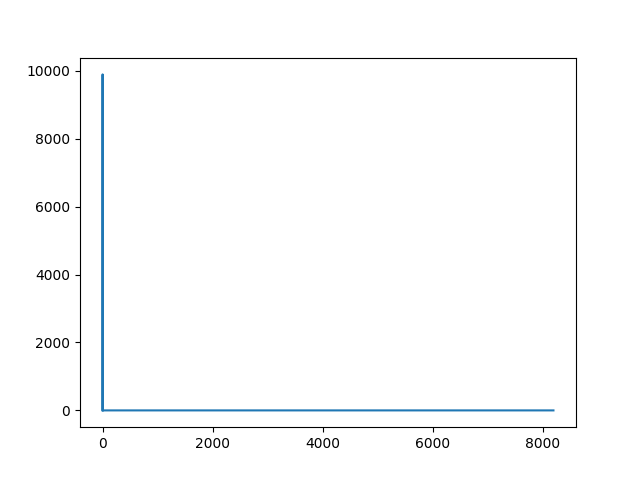
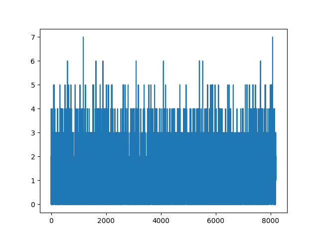

# hashtable

Implementation of a hashtable using chaining for collision resolution in C.

## Features

### Generic key/value storage
Keys and values are not required to have a predetermined size. This adds a little overhead to the
implementation but gives you much more freedome over the keys and values. 

### Custom hash function
The standard hash function operates on the bytes occupied by the key.
In case you encounter frequent hash collisions or simply want to experiment, you can specify a custom hash function:

```c
#include "hashtable.h"

// Don't use this as hash function!
size_t my_hash(void* key, size_t key_size) {
    return 1;
}

int main() {
    t_hash_table* ht = ht_new_c_hash(5, &my_hash);
    ht_insert(ht, "HE", "abc", 2, 3);
}
```

### Useful macros

To ease the use of the hashtable, you can use macros like `FOREACH`:

```c
t_hash_table* ht = ht_new(HT_INIT_CAPACITY);

ht_insert(ht, "abc", "123", 3, 3);
ht_insert(ht, "def", "456", 3, 3);
ht_insert(ht, "ghk", "678", 3, 3);
ht_insert(ht, "lmn", "910", 3, 3);

FOREACH(k, v, ht, {
      char* key = (char*)k;         // Cast the key void pointer to the type you require
      char* val = (char*)v;         // Cast the value to the type you require
      printf("%s=%s\n", key, val);
      // def=456
      // ghk=678
      // abc=123
      // lmn=910
})
```

### Analysis of hashtable

The hashtable implementation provides simple analysis tools to visualize the distribution of the keys.
For example, if the hash function

```c
size_t my_hash(void* key, size_t key_size) {
    return 1;
}
```

is used, every key gets stored in the position 1.
For a word list with the 9894 most common english words you get this plot:



which essentially shows a linked list.

If you use the standard hash implementation, you get



which looks much more uniform. At most 7 keys are stored in one slot and thus the search is essentially constant.
